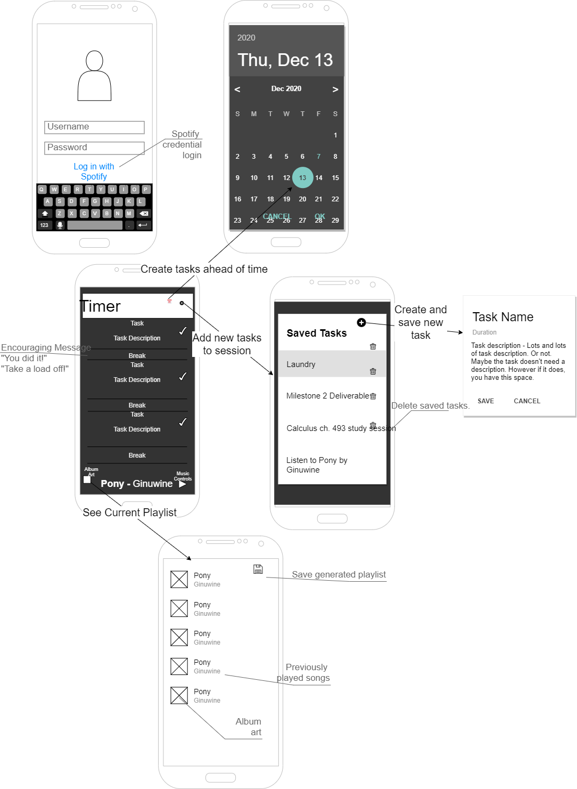

## Summary

The purpose of this app is to keep the user productive through the use of musical incentive. The app creates a playlist (connected to Spotify) with a length based on a timer set by the user to maximize productivity using the Pomodoro Method.
The Pomodoro method breaks your workday into 25 minute long chunks, with 5 minute breaks in between. After about 4 breaks, the fifth one is longer, which is generally around 15 minutes.

## Intended users

* Coders, Students  and anyone doing intensive work.

    > As a busy worker who loses track of time and gets stuck in my work without taking breaks, I need an app to remind me to reset and take scheduled break to make sure I don't overwork myself.

* People who need musical accompaniment to stay focused.

    > As someone who often loses track of time and loses focus when working, I need an app that simultaneously reminds me to take breaks to reset my brain , so that I may keep on schedule and give myself breaks when needed when working or exercizing.

## Functionality

* Take scheduled breaks using the Pomodoro Method's 25 minute interval system to maximize productivity.
* Connect to Spotify and sync your music library to accompany your work/study sessions.
* Generate a playlist from your library either at random using your saved library, or from your personal playlists, that has the exact length of 25 minutes, notifying you of your break with a pause in the music.
* Save the playlist that was generated to be able to use in the future.

## Wireframe

## Persistent data

* Saved & settable timers the user can determine for themselves.
* Spotify account information & preferences.
* Use of internal clock to determine the amount of time passed.
* Saved playlists to re-use at a later date.
    
## Device/external services

* [Spotify](https://developer.spotify.com/documentation/web-api/reference/) 

    * Music database
	* Account information & preferences
	* Synchronization of user's saved music and playlists
	* Music streaming data 
	* Authorization privileges
	
* [Android Media Player](https://developer.android.com/reference/android/media/MediaPlayer)
    
	* Control playback of audio streams
	* Start, Stop, Pause, Rewind, and Skip functionality
	

## Stretch goals/possible enhancements 

* Connectivity with friends to see playlists and upload their own.